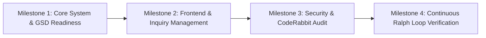

# 🗺️ GSD Roadmap & Feature Milestones

## 🎯 Project Overview
This roadmap outlines the milestones, architectural phases, feature tasks, and quality verification standards for the **Hotel Management System** built with Laravel 10.

---

## 🏆 Milestone Overview

---

## 📋 Milestones & Detailed Task Matrix

### 📍 Milestone 1: Core System & GSD Readiness (COMPLETED)
- [x] Initialized `.gsd/STATE.md`, `.gsd/ROADMAP.md`, and `.gsd/SCRATCH_MAP.md`.
- [x] Verified Laravel framework installation (`v10.50.0`) and database configuration.
- [x] Configured CodeRabbit AI rule file (`.coderabbit.yaml`) for PHP PSR-12, Blade escaping, and OWASP security.

### 📍 Milestone 2: Full Layout Refactoring & UI/UX Premium Elevation (COMPLETED)
- [x] **Master Layout Engine**: Created single-source HTML5 `main.blade.php` with meta tags, styles, yield content, and JS scripts.
- [x] **Header Navigation**: Created `header.blade.php` with dynamic route active state (`request()->is(...)`).
- [x] **Footer Partial**: Created `footer.blade.php` with newsletter subscription & alert notification handling.
- [x] **5-Star Luxury Styling**: Created `custom-luxury.css` with Google Fonts (`Playfair Display` & `Plus Jakarta Sans`), glassmorphism cards, and interactive hover states.
- [x] **View Cleanups**: Stripped duplicate `<!DOCTYPE html>`, `<head>`, `<body>`, and `<script>` blocks from `index`, `about`, `properties`, `gallery`, `blog`, `blog-single`, and `contact`.
- [x] **Form Handlers & Controllers**: Sanitized inputs in `BookingInquiryController.php`, `ContactController.php`, `NewsletterController.php`, and `CommentController.php`.

### 📍 Milestone 3: Automated Feature Testing & Empirical Verification (COMPLETED)
- [x] Configured `phpunit.xml` with SQLite in-memory DB testing.
- [x] Added `HotelFormSubmissionsTest.php` covering all 4 form submission endpoints (`/contact-submit`, `/check-availability`, `/newsletter-submit`, `/comment-submit`).
- [x] Verified full test suite (`php artisan test` - **7 tests passed, 17 assertions**).

### 📍 Milestone 4: Continuous Ralph Loop Verification
- [x] Maintain test coverage with feature tests for all POST endpoints.
- [x] Update `.gsd/STATE.md` after every successful test run.

---

## 🧪 Empirical Verification Protocol
Every task executed under Ralph Loop must pass the following empirical checks:
1. **Syntax & Style Check**: PHP code follows PSR-12 standard.
2. **Automated Unit & Feature Tests**: `php artisan test` must return 0 failing tests.
3. **Database Integrity**: Migrations and Eloquent schema bindings must be validated.
